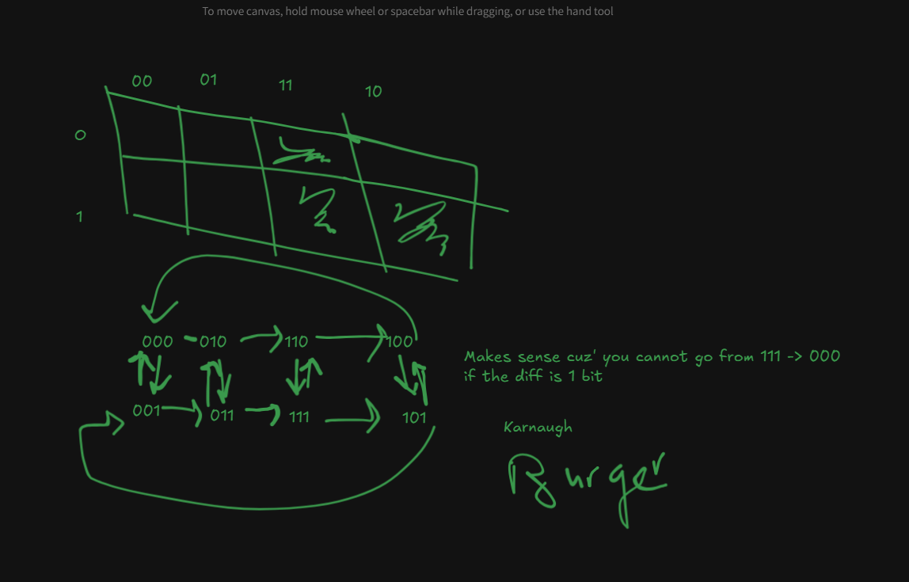

 **Chapter 1**
 - We can look at computer architecture from the point of view of software applications. This point of view is sometimes referred to as ARCHITECTURE in literature. 

- It is very important for students of computer architecture to study computer architecture from the viewpoint of a software designer because they need to know about the expectations of software writers from hardware. 

- Secondly, it is also important for software writers to know about computer architecture because they can tailor their software appropriately to make it more efficient.

- The other perspective is the point of view of hardware designers. Given the software interface, they need to design hardware that is compatible with it and also implement algorithms that make the system efficient in terms of performance and power. This perspective is also referred to as ORGANISATION in literature.

	a. Architecture: The view of a computer presented to software designers.
	b. Organization: The actual implementation of a computer in hardware.

- A computer is a general purpose device that can be programmed to process information, and yield meaningful results.

- Instructions are basic rudimentary commands used to communicate with the processor. A computer can execute billions of instructions per second.

- Let us now come to the semantics of instructions themselves. The same way that any language has a finite number of words, the number of basic instructions/rudimentary commands that a processor can support have to be finite. This set of instructions is typically called the **INSTRUCTION SET**.
	 Some examples of basic instructions are: add, subtract, multiply, logical or, and logical not. These instructions work on a set of variables and constants which are not defined but internal locations within the computer.

- The semantics of all the instructions supported by a processor is known as the **INSTRUCTION SET ARCHITECTURE (ISA)**. This includes the semantics of the instructions themselves, along with their operands, and interfaces with peripheral devices.

- We can think of an instruction set as a legal contract between software and hardware. 
	Both sides need to implement their side of the contract. The software part needs to ensure that all the programs that users write can be successfully and efficiently translated to basic instructions.
	Likewise, hardware needs to ensure that all the instructions in the instruction set are efficiently implementable.

- Necessary properties for an ISA:
	-  Complete: We want an ISA to be able to represent all programs that users are going to write for it. Note that some processors are designed to do only a limited set of tasks.

- Desirable properties of an ISA:
	* Concise: It should not have too many an instruction set as  it takes a fairly non-trivial amount of hardware to implement an instruction. Implementing a lot of instructions will unnecessarily increase the number of transistors in the processor and increase its complexity.

	* Generic: Should capture the common case and not the rare ones. For example the most common instructions on a program are the arithmetic ops: ADD, SUBTRACT, MULTIPLY, DIVIDE; logical ops like logical and, or, exclusive or, and not.

- A reduced instruction set computer (RISC) implements simple instructions that have a simple and regular structure. The number of instructions is typically a small number (64 to 128).  Examples: ARM, IBM PowerPC, HP PA-RISC.

- A complex instruction set computer (CISC) implements complex instructions that are highly irregular, TAKE MULTIPLE OPERANDS, and implement complex functionalities. Secondly, the number of instructions is large (typically 500+). Examples: Intel x86, VAX.

Modern processors typically use a hybrid approach where they have simple, as well as some complicated instructions. However, under the hood CISC instructions are translated into RISC instructions.
Hence, we believe that the scale tilts slightly more towards RISC instructions. We shall thus consider it a desirable property to have simple instructions.

*Simple - Instructions should be simple and regular.

- A machine that can execute any program is known as a UNIVERSAL MACHINE. It is a machine that can execute all programs. We can treat each basic action of this machine as an instruction. Thus the set of actions of a universal machine is its ISA, and this ISA is complete. Consequently, when we say that an ISA is complete, it is the same as saying that we can build a universal machine exclusively based on the given ISA.

- A Turing machine which is the theoretical entity describing a universal machine is a simple and is made up of 
	1. An infinite tape containing cells, each with a symbol from a finite set of alphabets. '$' cell as a marker.
	2. A tape head that points to the current cell and can move left or right. It overrides the pointed cell's symbol and registers the prev/current state to the:
	3. State register: A storage for a finite set of states based on tape head's current -> state/symbol combo.
	4. Action table (a transition function table or action table.) that receives the state/symbol combo from the tape head and lookup the {l/r? movement of the tape head, new state (to be saved in the register), new symbol (to override the current cell)}.
	
-  Church Turing Thesis: Any real world computation/problem can be translated into an equivalent computation involving a Turing machine.  In lay man’s terms, any program that can be computed by deterministic algorithms on any computer known to man, is also computable by a Turing machine.

- A true universal machine will have the same action table, symbols, and also the same set of states for every function. It is possible to construct a universal Turing machine that can simulate any other Turing machine.

- Such machine will have a generic structure and not be specific to the function being computed. Its tape is thus divided into three parts. The first part contains the simulated action table, the second part contains the simulated state register, and the last part contains the work area that contains a set of simulated symbols. The universal Turing machine(U) has a very simple action table and set of states. The idea is to find the right entry in the simulated action table that matches the value in the simulated state register and simulated symbol under the tape head. Then the universal Turing machine needs to carry out the corresponding action by moving to a new simulated state, and overwriting the simulated symbol in the work area if required.
- Any computing system that is equivalent to a Turing machine is said to be Turing complete. The ISA of such system is said to be complete or universal.

- A Modified Universal Turing Machine:
	1. The tape is semi-infinite (extends to infinity in only one direction).
	2. The simulated state is a pointer to an entry in the simulated action table.
	3. There is one unique entry in the simulated action table for each state. While looking up the simulated action table, we do not care about the symbol under the tape head.
	4. An action directs the tape head to visit a set of locations in the work area, and based on their values computes a new value using a simple arithmetical function. It writes this new value into a new location in the work area.
	5. The default next state is the succeeding state in the action table.
	6. An action can also arbitrarily change the state if a symbol at a certain location on the tape is less than a certain value. Changing the state means that the simulated tape head will start fetching actions from a new area in the simulated action table.

- This Turing machine suggests a machine organization of the following form. There is a large array of instructions (action table). This array of instructions is commonly referred to as the program. There is a state register that maintains a pointer to the current instruction in the array. We can refer to this register as the program counter. It is possible to change the program counter to point to a new instruction. There is a large work area, where symbols can be stored, retrieved and modified. This work area is also known as the data area. The instruction table (program) and the work area (data) were saved on the tape in our modified Turing machine.
- In a practical machine, we call this infinite tape as the memory. The memory is a large array of memory cells, where a memory cell contains a basic symbol. A part of the memory contains the program, and another part of it contains data.

**Data refers to variables and constants that are used by the program. We need to note that we have captured all aspects of a Turing machine: state transition, movement of the tape head, overwriting symbols and decisions based on the symbol under the tape head

- Single Instruction ISA: Have only one instruction (for our modified Turing Machine). It is possible to achieve completeness with just this instruction (i.e. We can represent/compute anything with just an instruction thus a complete ISA with just one instruction). For example: 
	*sbn = subtract and branch if negative (sbn a, b,  c ) => subtract data in loc b from data in loc a, if a < 0, jump to read instructions from loc c. 
	Others include subtract and branch if less than equal to, reverse subtract and skip if borrow, and a computer that has generic memory move operations.

- Multiple Instruction ISA: Single ISA are hard/stressful to implement, to ease the pain we can split the Single ISA into multiple ISA:
	In any instruction set, we need at least three types of instructions:
	1. We need arithmetic instructions to perform operations such as add, subtract, multiply, and divide. Most instruction sets also have specialized instructions in this category to perform logical operations such as logical OR and NOT.
	2. MOVE -  We need data transfer instructions that can transfer values between memory locations and can load constants into memory locations.
	3. BRANCH - We need branch instructions that can start executing instructions at different points in the program based on the values of instruction operands
 
- Summary of theoretical study of computers:
	1. The problem of designing a complete ISA is the same as that of designing a universal machine. A universal machine can run any program. We can map each instruction in the ISA to an action in this universal machine. A universal machine is the most powerful computing machine known to man. If a universal machine cannot compute the result of a program because it never terminates (infinite loop), then all other computing machines are also guaranteed to fail for this program.
	2. Universal machines have been studied extensively in theoretical computer science. One such machine is the Turing machine named after the father of computer science – Alan
	Turing.
	3. The Turing machine is a very abstract computing device, and is not amenable to practical implementations. A practical implementation will be very slow and consume a lot of resources. However, machines equivalent to it can be much faster. Any such machine, ISA, and computing system that is equivalent to a Turing machine is said to be Turing complete.
	4. We defined a modified Turing machine that is Turing complete. Its main parts and salient features are as follows.
		(a) It contains a dedicated instruction table that contains a list of instructions.
		(b) It has a program counter that keeps track of the current instruction that is being executed. The program counter contains a pointer to an entry in the instruction
		table.
		(c) It has a semi-infinite array of storage locations that can save symbols belonging to a finite set. This array is known as the memory
		(d) The memory contains the instruction table (also referred to as the program), and contains a data area. The data area saves all the variables and constants that are
		required by the program.
		(e) Each instruction can compute the result of a simple arithmetic function using values stored at different memory locations. It can then save the result in another memory
		location.
		(f) The machine starts with the first instruction in the program, and then by default, after executing an instruction, the machine fetches the next instruction in the instruction table.
		(g) It is possible for an instruction to direct the machine to fetch a new instruction from an arbitrary location in the instruction table based on the value stored in a memory
		location.

- **DESIGN OF PRACTICAL MACHINES**
	A. Harvard ARCHITECTURE - Harvard Mark 1
	1. It has a separate structure for memory storage and instruction storage.
	2. It has a Control unit meant to fetch instructions, process and coordinate their execution.
	3. Its Arithemetic and Logic Unit ALU, is meant for carrying out arithemetic ops and logical ops.
	4. It also takes in input from programmers and displayed output.

- One of the earliest efforts in this direction was the Harvard Mark-I. The Harvard architecture is very similar to our concept machine (The CPU one). There are separate structures for maintaining the instruction table and the memory.
- The former is also known as instruction memory because we can think of it as a specialized memory tailored to hold only instructions. The latter holds data values that programs need.
- Hence, it is known as the data memory. The engine for processing instructions is divided into two parts – control and ALU. The job of the control unit is to fetch instructions, process them, and co-ordinate their execution. ALU stands for arithmetic-logic-unit. It has specialized circuits that can compute arithmetic expressions or logical expressions (AND/OR/NOT etc.).

	B. Vonn Neumann ARCHITECTURE

- The path breaking innovation in this machine was that the instruction table was stored in memory. It was possible to do so by encoding every instruction with the same set of symbols that are normally stored in memory. For example, if the memory stores decimal values, then each instruction needs to be encoded into a string of decimal digits. A Von Neumann CPU needs to decode every instruction. The crux of this idea is that instructions are treated as regular data(memory values). We shall see in later chapters that this simple idea is actually a very powerful tool in designing elegant computing systems. This idea is known as the ->  Stored-program concept: A program is stored in memory and instructions are treated as regular memory values.

- This is a powerful concept as many computers today are designed like this to minimize resources and achieve a unified processing system that treats data and instructions the same way.
 
- From the point of view of the CPU, the program counter points to a generic memory location whose contents will be interpreted as that of an encoded instruction. It is easy to store, modify, and transmit programs. Programs can also dynamically change their behavior during runtime by modifying themselves and even other programs. This forms the basis of today’s complex compilers that convert high level C programs into machine instructions. Furthermore, a lot of modern systems such as the Java virtual machine dynamically modify their instructions to achieve efficiency.

- Lastly, astute readers would notice that a Von Neumann machine or a Harvard machine do not have an infinite amount of memory like a Turing machine. Hence, strictly speaking they are not exactly equivalent to a Turing machine. This is true for all practical machines. They need to have finite resources. Nevertheless, the scientific community has learnt to live with this approximation.

**VARAINTS OF THE VONN NUEMANN ARC**:

1. Registers

The memory is typically a very large structure. In modern processors, the entire memory can contain billions of storage locations. Any practical implementation of a memory of this size is fairly slow in practice. There is a general rule of thumb in hardware, “large is slow, and small is fast.” Consequently, to enable fast operation, every processor has a small set of registers that can be quickly accessed.
The term “register machine” refers to a class of machines that in the most general sense contain an unbounded number of named storage locations called registers.
A register is a storage location that can hold a symbol. These are the same set of symbols that are stored in memory. For example, they can be integers. These registers can be
accessed randomly, and all instructions use register names as their operands. The CPU accesses the registers, fetches the operands, and then processes them.
Since programs tend to use a small set of variables repeatedly at any point of time, using registers saves many memory accesses. However, it sometimes becomes necessary to bring in memory locations into registers or writeback values in registers to memory locations. In those cases, we use dedicated load and store instructions that transfer values between memory and registers. Most of the operands in arithmetic and branch operations are present in these registers.

2. Stacks

A stack is a standard data structure that obeys the semantics – last in, first out. First, it is necessary to insert values from the memory into the stack. After that arithmetic
functions operate on the top k elements of the stack. These values get replaced by the result of the computation. For example, if the stack contains the values 1 and 2 at the top. They get removed and replaced by 3. Note that here arithmetic operations do not require any operands. If an add operation takes two operands, then they do not need to be explicitly specified. The operands are implicitly specified as the top two elements in the stack. Likewise, the location of the result also does not need to be specified. It needs to be inserted at the top of the stack. Even though, generating instructions for such a machine is difficult and flexibility is an issue, the instructions can be very compact. Most instructions other than load and store do not require any operands. We can thus produce very dense machine code.
A stack supports two operations – push (LOAD) and pop (SAVE). Push pushes an element to the top of the stack. Pop removes an element from the top of the stack. ^5b8bc9

Simple structure of the stack based implementation: It is clearly visible that scheduling a computation to work on a stack is difficult. There will be many redundant loads and stores. Nonetheless, for machines that are meant to evaluate long mathematical expressions, and machines for which program size is an issue, typically opt for stacks. Its simple structure allows the JVM to assume a hardware implementation during compilation so that at runtime the JVM transpiles it to instructions that can be run on any machine i.e. on register-based processors.

3. Accumulator based Machines

Accumulator based machines use a single register called an accumulator. Each instruction takes a single memory location as an input operand. For example, an add operation adds the value in the accumulator to the value in the memory address and then stores the result back in the accumulator. Early machines in the fifties that could not accommodate a register file used to have accumulators. Accumulators were able to reduce the number of memory accesses and speed up the program. Some aspects of accumulators have crept into the Intel x86 set of processors that are the most commonly used processors for desktops and laptops as of 2012. For multiplication and division of large numbers, these processors use the register eax as an accumulator. For other generic instructions, any register can be specified as an accumulator.

## Bits

- Bit: A variable that can have two values: 0 or 1.
- Byte: A sequence of 8 bits.

Binary variables can also be called Boolean variables based on an algebraic system of operations and operators introduced to describe digital electronic circuits inspired by the Boolean system of George Boole.

- Boolean variable A variable that can take only two values – 0 or 1. 
- Boolean algebra An algebraic system consisting of Boolean variables and some special operators defined on them.

***Logical complements** : negation or NOT operator.*

**Truth table**:  A table that lists the outputs of the Boolean operator for all possible combinations of inputs.

*NOT operator* -> Let the logical complement of A be ~A. 
TT 
A | ~A
0      1
1      0
If A = 1, ~A = 0 and if A = 0, ~A = 1.

*OR operator* -> either A or B can be 1. It is represented by `v` or `+`
i.e. A OR B = 1, if A = 1 and B = 0 or B = 1 and A = 0 or A = 1 and B = 1
TT 
A |   B  | A OR B
0      0        0
0      1        1
1      0        1
1      1        1

*AND operator* -> Represented by `.` or `^` , both A and B has to be 1 or 0. Consider a problem where only one of A, B and C can be 1. This implies two conditions
1. Only one of A, B and C can be 1.
	~ A + B + C = 1. 
1. No two variables can be 1 at the same time.
	~ A.B + A.C + B.C = 0.
TT 
A |   B  | A AND B
0      0        0
0      1        0
1      0        0
1      1        1

We can say that NOT, AND, and OR, are basic operators. We can now derive a set of operators from them.

**Derived Operators**
We can combine basic Boolean ops to get derived ops like NAND and NOR. NAND is the logical complement of AND while NOR is that of OR. NAND and NOR are very important operators because they are known as universal operators. We can use just the NAND operator or just the NOR operator to construct any other operator.
TT for NAND
A |   B  | A NAND B
0      0        1
0      1        1
1      0        1
1      1        0

TT for NOR
A |   B  | A NOR B
0      0        1
0      1        0
1      0        0
1      1        0

*XOR or Exclusive-OR operator* -> This implies only one of A or B can have a binary value (1 or 0) at the same time. A XOR B is 1 if A = 1 and B = 0 or A = 0 and B = 1. Represented by ⊕. 
A ⊕ B = A.~B + ~A.B 
TT for XOR
A |   B  | A XOR B
0      0        0
0      1        1
1      0        1
1      1        0
### Rules 

***NOT Operator*** 
1. **Definition**: ~0 = 1, and ~1 = 0 –> This is the definition of the NOT operator. 
2. **Double negation**:  ~~ A  = A –> The NOT of (NOT of A) is equal to A itself.

***OR and AND Operators*** 
1. **Identity**: A + 0 = A, and A.1 = A – If we compute the OR of a Boolean variable, A, with 0, or AND with 1, the result is equal to A.
2. **Annulment**: A + 1 = 1, and A.0 = 0 – If we compute A OR 1, then the result is always equal to 1. Similarly, A AND 0, is always equal to 0 because the value of the second operand determines the final result.
3. **Idempotence**: A + A = A, and A.A = A – The result of computing the OR or AND of A with itself, is A.
4. **Complementarity**: A + ~A = 1, and A.~A = 0 – Either A = 1, or ~A = 1. In either case A + ~A will have one term, which is 1, and thus the result is 1. Similarly, one of the terms in A.~A is 0, and thus the result is 0.
5. **Commutativity**: A.B = B.A, and A + B = B + A – The order of Boolean variables does not matter.
6. **Associativity**: A + (B + C) = (A + B) + C, and A.(B.C) = (A.B).C – We are free to parenthesize expressions containing only OR or AND operators in any way we choose.
7. **Distributivity**: A.(B + C) = A.B + A.C, and A + B.C = (A + B).(A + C) – We can use this law to open up a parenthesis and simplify expressions.

**De Morgan's Law**

1. ~(A + B) = ~A.~B -> (NOT of A OR B \[NOR] is equal to the AND of the complements of A and B).
	TT
	A | B | A + B | ~(A + B)          ->      ~A | ~B | ~A.~B
	1    0      1             0                           0      1       0
	0    1      1             0                           1      0       0

2. ~(A.B) = ~A + ~B -> (NOT of A AND B \[NAND] is equal to the OR of the complements of A and B).
	TT
	A | B | A.B | ~(A.B)          ->      ~A | ~B | ~A + ~B
	1    0      0      1                           0      1       1
	0    1      0      1                           1      0       1

***Logic Gates*** are devices that implement Boolean functions/formulae.

Let us consider a Boolean function f with n arguments. 
i.e. f(A,B,C) = A.B.~C + A.B.C + A.~B.C 
This is gotten by getting Boolean expressions that evaluate to a logical 1 i.e.
TT
A | B | C | Result
1   1    0     1
1   1    1     1
1   0    1     1
This means for those variables equal to 0 are represented by their logical complements to resolve to 1 hence i.e. ~C and ~B.

***minterm***:  A minterm is an AND function on all n Boolean variables, where each variable appears only once (either in its original form or in its complemented form). A minterm corresponds to one line in the truth table, whose result is 1. (ex. A.B.~C).
***Canonical representation***: It is a Boolean formula, which is equivalent to the function f. It computes an OR operation of a set of minterms. (A.B.~C + A.B.C + A.~B.C).

To implement Boolean functions using a truth table (Simple method), we first get a list of minterms that might evaluate to a logical 1 (true), then create a canonical representation, and then realize it with logic gates. To realize the canonical representation using logic gates, we need to realize each minterm separately, and then compute an OR operation.

**Karnaugh Maps**: 

A more efficient method is the Karnaugh map (K-Map). Steps to produce a K-Map include.
1. Represent all minterms such that the order of variables in them is the same (original or complemented). 
2. Second, if a variable is not complemented, then let us represent it by 1, otherwise, let us represent it by 0.
3. Minterm Representation ~A.~B.~C - 000, ~A.~B.C - 001, ~A.B.~C - 010, A.~B.~C 100, ~A.B.C 011, A.~B.C 101, A.B.~C 110, A.B.C 111 which is representation of all the possible 8 minterms in a three variable function (2^3 = 8).
4. Draw a 2X4 grid of squares. Depending on the num of bits (variable size), label the the rows with some bits (0 and 1) and use the rest to label the columns (i.e. 00, 01, 11 etc.). This allows the diff btw two adjacent cells (either row or columns) and columns/rows to be one variable/one bit.

5. Now we can shade the original Boolean function out (f(A,B,C) = A.B.~C + A.B.C + A.~B.C ). Remember from our combinations, negated variables are represented with zero therefore f(A,B,C) = 110 + 111 + 101.

**Simplifying our expression**:

We can further simplify our expression in two ways:
1. Combining two adjacent cells in the same column with diff in one variable ~C which has its original and complemented version in an OR expression => A.B.~C + A.B.C => A.B.~C + A.B.C = A.B.(C + ~C) = A.B.1 = A.B. Therefore => A.B + A.B.C
2.  Combining two adjacent cells in the same row with diff in one variable ~B which has its original and complemented version in an OR expression => A.B.C + A.~B.C => A.~B.C + A.B.C = A.C.(B + ~B) = A.C.1 = A.C. Therefore => A.C + A.B.C

### Positive Integers

Computers are best suited to process values that are either 0 or 1. They find it difficult to process values from a larger set. Hence, representing numbers in base 2 should be a natural fit for computers.
- A number system based on Indian numerals that uses a base equal to 2, is known as a *binary number system*. 
- A number system based on Indian numerals that uses a base equal to 10, is known as a *decimal number system*.

Formally, any number A can be represented as a sequence of n binary digits:

$$
\sum_{i=1}^{n} x_i *2^{i-1}
$$
The coefficients of the equation, are the binary digits. For example, the decimal number 23 is equal to 
$$
(16 + 4 + 2 + 1) = 1 × 2^4 + 0 × 2^3 + 1 × 2^2 + 1 × 2 + 1 
$$ Thus, its binary representation is 10111.

- MSB (Most Significant Bit) : The leftmost bit of a binary number. For example the MSB of 1110 is 1. 
- LSB (Least Significant Bit) : The rightmost bit of a binary number. For example the LSB of 1110 is 0.

#### Hexadecimal and Octal Numbers

Numbers represented in base 8 are known as octal numbers. They are traditionally represented by adding a prefix, ’0’. The more popular representation is the hexadecimal number system. It uses a base equal to 16. Numbers in this format are prefixed by ‘0x’. Secondly, the word ‘hexadecimal’ is popularly abbreviated as ‘hex’. Note that we require 16 hex digits. We can use the digits 0-9 for the first ten digits. The next six digits require special characters. These six characters are typically – A (10), B(11), C(12), D(13), E(14), and F(15). We can use the lower case versions of ABCDEF also.

To convert from binary to hex digits, we consider the following:

$$
\sum_{i=1}^{n} x_i *2^{i-1}
$$

$$
\sum_{j=1}^{n/4} (2^3 * x_{4(j-1)+4} + 2^2 * x_{4(j-1)+3} * 2^1 * x_{4(j-1)+2} * x_{4(j-1)+1}) * 2^{4(j-1)})
$$

$$
yj = (2^3 * x_{4(j-1)+4} + 2^2 * x_{4(j-1)+3} * 2^1 * x_{4(j-1)+2} * x_{4(j-1)+1})
$$

$$
\sum_{j=1}^{n/4} yj*16^{j(i-1)}
$$
We can thus represent the number (A) in base 16 (hexadecimal notation) by creating groups of four consecutive binary digits. The first group is comprised of the binary digits 
$$
x_4x_3x_2x_1 
$$
the second group is comprised of 
$$
x_8x_7x_6x_5
$$
and so on. We need to convert each group of 4 binary digits, to represent a hexadecimal digit 
*(yj)*.
**Note**: We only multiply by *16^(j - 1)* when we want to convert from hex to decimal.
Similarly, for converting a number from hex to binary, we need to replace each hex digit with a sequence of 4 binary digits.

**Adding Bits**

Adding bits is straight-forward and similar to adding decimals. The bits are added and the result consists of two bits 
- The least significant bit (right most bit) sum and the 
- Carry bit (C_out). 

C_out is then carried over to the more significant bit to the left. It is now designated C_in for this bit and is added to the result of the addition of the two operands.

TT for the sum

A | B | (A + B)
0    0     00
1    0     01
0    1     01
1    1     10

TT for all combo of A + B + C_in:

0 + 0 +0 = 00
0 + 1 + 0 = 01
1 + 0 + 0 = 01
1 + 1 + 0 = 10
0 + 0 + 1 =  01
0 + 1 +  1 = 10
1 +  0 + 1 = 10
1 + 1 + 1 = 11

**Sizes Of Integers**

Positive Integers -> Unsigned Integers
- Short -> 2 bytes -> 16 bits (1 byte = 8 bits)
- Int -> 4 bytes -> 32 bits
- Long long int -> 8 bytes -> 64 bits
The range of numbers a n-bit binary representation can hold is from 0 to $$ 2^n -1$$
i.e. 16 => 2^16 - 1 = ??

**Note**: smallest num is 0 i.e. all 16 bits are 0 and largest num has all bits as 1. Therefore 
$$ 2^{15} + ... 2^0 = 2^{16} - 1 $$
Sum of the nth term in a geometric series

$$ S_n  = (a^r - 1)/(r-1)

$$
where n = 15, geometric ratio (r) = * 2^1

